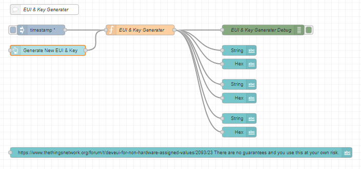

# EUI & Key Generator

This is a Node-Red flow to generate AppEUI, DEVEUI and AppKey to be used in personal projects

## Content

- [1. Introduction](##1.-introduction)
    - [1.1 Node-Red](###1.1-node-red])
    - [1.2 Flow](###1.2-flow)
    - [1.3 Generate EUI & Key](###1.3-generate-eui-&-key)

## 1. Introduction
This project is for the 'Random' genetration of AppEUI, DEVEUI and AppKey. I am referencing to a post on TTN forum for the accepted way to generate these - https://www.thethingsnetwork.org/forum/t/deveui-for-non-hardware-assigned-values/2093/23.

### 1.1 Node-Red
Need to install Node-red on you PC, please refer to the official site https://nodered.org/docs/

### 1.2 Flow
Install the [EUI&Key Generator](eui_key.json) flow in your node-red

### 1.3 Generate EUI & Key
You can just now press the 'Generate New EUI & Key' button and new EUI & Key will be generate

